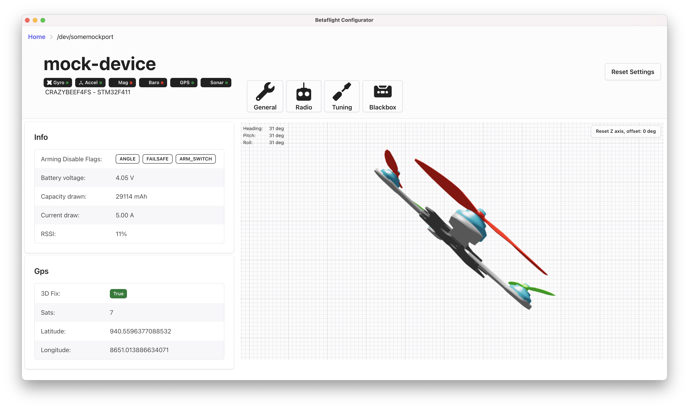

# Fresh configurator

> A re-write of the Betaflight configurator

[](https://github.com/freshollie/fresh-configurator/actions)
[](https://coveralls.io/github/freshollie/fresh-configurator?branch=master)
[](https://github.com/prettier/prettier)
[](https://freshollie.github.io/fresh-configurator)

<p align="center">
  
</p>

## What is this?

This is a new version of the [betaflight configurator](https://github.com/betaflight/betaflight-configurator) which is attempting to re-write the software in more modern technologies.

The current configurator is both written without a UI framework,
and doesn't utilise any of the modern javascript packages and package management which
exist today.

The aim of this rewrite is to show how the software could be vastly improved
and simplified, and that by doing so attract more contribution to the software.

It would also allow for easier refactoring and redesigning of the UI.

## What's happening right now?

At the moment functionality is very minimal, and lots is changing all the time.

- The MultiWii protocol sourcecode has been ported into Typescript, and utilises promises. It's available in the [@fresh/msp](packages/msp) package.
- Tests have been written for most of `@fresh/msp`
- The main layout, device connection controls, logging, model information, navigation, instruments, receiver channels have been written
- [Storybook](https://freshollie.github.io/fresh-configurator) is utlised to develop components

## What's the plan?

Idealy, to become feature complete with the current configurator. The overall goal of the project, however, is to simplify the requirements to develop your own configurator or customise an existing one.

## Developing

```bash
$ yarn
```

### Running the application

```
$ yarn start
```

### Component development enviroment

```
$ yarn storybook
```

### Compile `@fresh/msp` changes

```
$ yarn prepare
```
