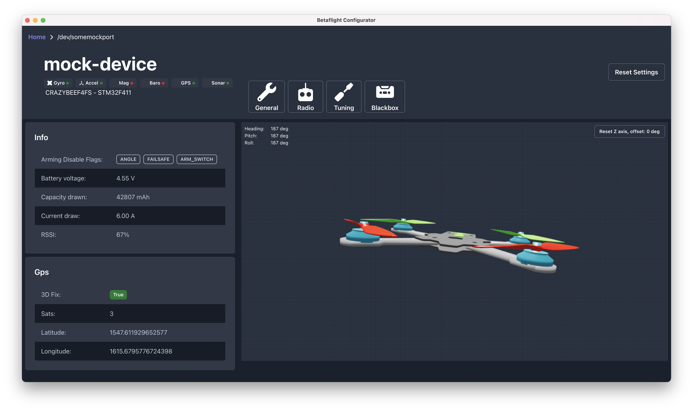

# Fresh configurator

> A re-written simplication of the Betaflight configurator

[](https://github.com/freshollie/fresh-configurator/actions)
[](https://codecov.io/gh/freshollie/fresh-configurator)
[](https://github.com/prettier/prettier)
[](https://betaflight-storybook.netlify.app)

<p align="center">
  
  
</p>

## What is this?

This is a **from-scratch** re-write of the [betaflight configurator](https://github.com/betaflight/betaflight-configurator) which is attempting to replace the software with more a modern and
correct approach.

The current configurator is both written without a UI framework (apart from jQuery),
and doesn't utilise any of the modern javascript tooling and package management which
exist today.

The aim of this rewrite is to show how the software could be vastly improved
and simplified, and that by doing so attract more contribution to the software.

[Try it out!](https://betaflight-configurator.netlify.app?backend=wss://betaflight-mock-api.herokuapp.com)

## What's happening right now?

At the moment functionality is very minimal, and lots is changing all the time.

- The MultiWii protocol sourcecode has been ported into TypeScript, and utilises promises. It's available in the [@betaflight/msp](packages/msp) package.
- [Tests have been written](packages/msp/test) for all of `@betaflight/msp`
- The Betaflight API has been ported into [`@betaflight/api`](packages/api), and has high test coverage
- The API exists as [graphql schema](https://betaflight-mock-api.herokuapp.com) within [`@betaflight/api-graph`](packages/api-graph)
- The main layout, device connection controls, logging, model information, navigation, instruments, receiver channels have been written in [`@betaflight/configurator`](packages/configurator)
- [Storybook](https://betaflight-storybook.netlify.app) is utlised to develop components

## What's the plan?

Idealy, to become feature complete with the current configurator. The overall goal of the project, however, is to simplify the requirements to develop your own configurator or customise an existing one.

Because `@betaflight/msp` is written separately it is published as its own package, available for anyone to build tools which can interact with flight controllers. As `@betaflight/api` is also separate, it provides the ability for people to publish tools which can integrate with betaflight, just by using the API.

## Packages

| Project                                           | Description                                                                                            |
| ------------------------------------------------- | ------------------------------------------------------------------------------------------------------ |
| [@betaflight/configurator](packages/configurator) | The betaflight configurator electron application, built using the rest of the libraries                |
| [@betaflight/api-graph](packages/api-graph)       | A GraphQL schema to read data from betaflight flight controllers, built using the @betaflight/api      |
| [@betaflight/api](packages/api)                   | The betaflight API, built using @betaflight/msp                                                        |
| [@betaflight/msp](packages/msp)                   | A library for handling the MultiWii Serial Protocol for reading and writing data to flight controllers |
| [@betaflight/api-server](packages/api-server)     | A GraphQL server which implements `@betaflight/api-graph`                                              |

## Developing

### Requirements

- `node@12`
- `yarn`

If you have `nvm` run `nvm use` to use the correct node version

**PLEASE NOTE, THIS SOFTWARE IS WORK IN PROGRESS AND THINGS ARE CHANGING ALL THE TIME**

```bash
$ yarn
```

### Running the application

```
$ yarn start
```

### Running the application in a mocked device environment

```
$ yarn start:mocked
```

### Component development environment

```
$ yarn storybook
```

### Compile the application (for your current OS)

```
$ yarn build
```

### Tests

Tests can be run across the entire codebase at once

```
$ yarn test
```

End To End tests can be executed against the built application to verify that the UI
functions as expected

```
$ yarn e2e:production
```

## Architecture

```
 - - - - - - - - - - - - - - - - - - - -
|          Electron Application         |
|                   |                   |
|     renderer      |        main       |
|                   |                   |
|   configurator <----->   api-graph    |
|                   |          |        |
|                   |          V        |
|                   |         api       |
|                   |          |        |
|                   |          V        |
|                   |         msp       |
|_ _ _ _ _ _ _ _ _ _|_ _ _ _ _ | _ _ _ _|
                               V
                       Flight Controller
```

This is a monorepo application, with the design being to allow a single feature
to be able to make changes to the entire application stack, but for the packages to be separate enough
to exist on their own.

By segrating logic into their own packages, code barriers are
automatically added to discourage interdependency. Because parts of the
application are publishable, they must be written to exist on their own and thus
create even less interdependency.

The only package which cannot exist outside of the monorepo is
`@betaflight/configurator` as it is the final export of this repo.

Heavy use of TypeScript and `graphql-code-generator` is made throughout the monorepo to ensure
the datatypes transmitted between the flight controller and the configurator are
consistent at compile time and `graphql` ensuring the datatypes are consistent at
runtime. This means that there are many checks in place before even testing the
application.

### Configurator

The configurator is built with React and uses GraphQL as the core state of the application.
[`@apollo/client`](https://github.com/apollographql/apollo-client) is the magic behind all of this.
It provides the [hooks](https://reactjs.org/docs/hooks-intro.html) and rerender triggers for the
components when application state changes, which means no render loop.

Client and Device state is held in the same graph, and can be queried from any component in the application.
The client state graph is described in the [client schema](packages/configurator/src/gql/client.ts), and device
state is described in the [device schema](packages/api-graph/src/graph).

Because retreiving state from the device is expensive, the client will cache all device state in its graph
so that queries are only executed for data which is not available in the graph.

The schema of the client and device state are used to enforce that all code which uses the state is
type-safe. This means that changes to the API will not compile unless the configurator and api-server
schema is updated to match the types from the API.

#### Queries

Querying the device is as simple as describing the data you want to retreive:

```tsx
...

import { useQuery } from "@apollo/client";
import useConnection from "../hooks/useConnection";

const FcStatusProvider: React.FC = () => {
  const { connection } = useConnection();
  const connection = useQuery(
    gql(/* GraphQL */
      `query Status($connection: ID!) {
          connection(connectionId: $connection) {
            device {
              status {
                cycleTime
                i2cError
                cpuload
              }
            }
          }
        }
      `
    ),
    {
      variables: {
        connection,
      },
      // Fetch this data every 100ms
      pollInterval: 100
    }
  );

  ...

  // display all 0 values while the device status is loading
  return (
    <StatusList>
      ...
      <li>I2C error: {device?.status.i2cError ?? 0}</li>
      <li>Cycle Time: {device?.status.cycleTime ?? 0}</li>
      <li>CPU Load: {device?.status.cpuload ?? 0}%</li>
    </StatusList>
  )
};
```

Running [codegen](https://github.com/dotansimha/graphql-code-generator) (`yarn codegen`), will autoamtically ensure that
the `gql` tag will return the exact type shape to match your query!
